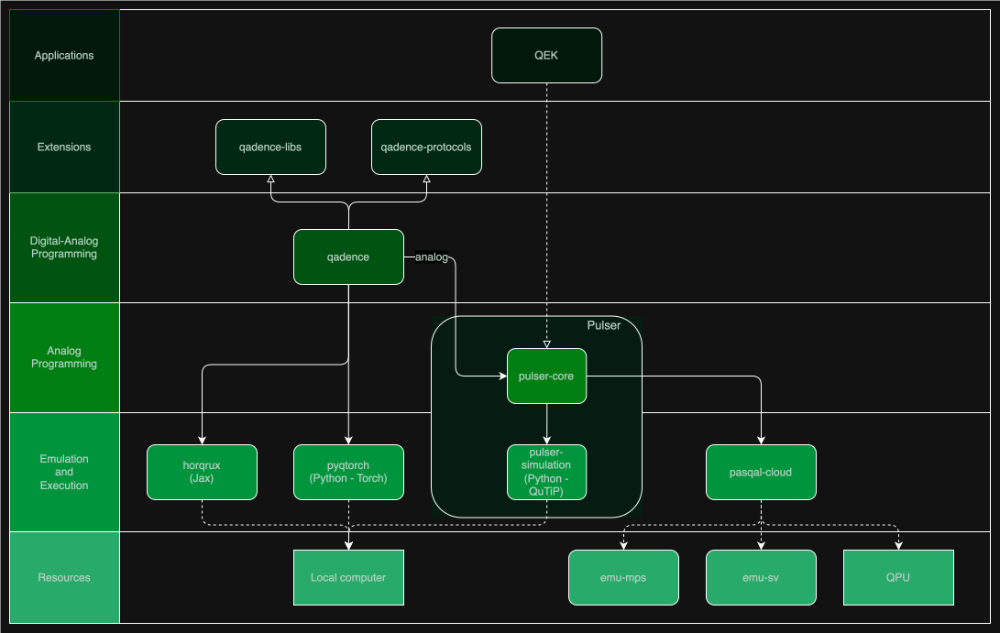

# Pasqal Repositories Overview

[Pasqal](https://pasqal.com) is a full-stack quantum computing company that provides hardware and software to leverage uses cases through neutral-atom quantum technology.

The first generation of Quantum Processing Units (QPUs) made at Pasqal are analog quantum computers. We strive to reach pratical quantum advantage in the analog and digital-analog approach with these QPUs.
The next generations of QPUs will be developed towards fault-tolerant digital quantum computers.
In order to support the development of such applications we have developed a suite of programming interfaces and emulators that you will find here on our GitHub.

The schema above is organized in terms of functionality layers as follows:

## Core technologies

Our core libraries for building quantum programs are Pulser and Qadence. Pulser provides hardware-near abstractions, and Qadence provides higher-level information theoretic abstractions. Both provide building blocks to program neutral atom devices.

* [Pulser](https://github.com/pasqal-io/Pulser): A framework of easy-to-use Python libraries for designing, simulating and executing analog quantum programs in the form of pulse sequences for neutral-atom QPUs. Pulser focuses on facilitating the creation of valid quantum programs accounting for the physics of the device. In this way, Pulser produces quantum programs in a format that the QPU can execute and that faithfully and directly represent how the device operates.

* [Qadence](https://github.com/pasqal-io/qadence): a Python package to write higher-level quantum programs in the digital and digital-analog paradigm. Qadence features tunable qubit interactions, and allows arbitrary register topology customization as possible on neutral atom devices.

## Extensions layer

These libraries provide additional features for applications on top of the core libraries.

* [Qadence-Libs](https://github.com/pasqal-io/qadence-libs): a collection of libraries to enhance Qadence functionalities suitable for a class of problems, _i.e._ QUBO, graph embedding, QML.

* [Qadence-Protocols](https://github.com/pasqal-io/qadence-protocols): error mitigation and measurement handling protocols for Qadence.

* [QEK](https://github.com/pasqal-io/quantum-evolution-kernel/): Python library for integrating quantum-driven similarity metrics into graph-based machine learning. It does not only simplify the use of quantum features, it proposes a way to extract features for graphs using a quantum simulation, following the framework from "[Quantum feature maps for graph machine learning on a neutral atom quantum processor](https://journals.aps.org/pra/abstract/10.1103/PhysRevA.107.042615)" . Designed for both beginners and experts, it provides an intuitive interface to explore quantum-enhanced graph learning with Pasqal's Neutral Atom QPU.

## Backend layer

### QPU

* [Pasqal-cloud](https://github.com/pasqal-io/pasqal-cloud): a Python SDK for communicating with Pasqal's Cloud Services. With Pasqal-cloud users can submit Pulser sequences to be executed on the QPU. The cloud also provides access to further emulators based on tensor networks that are not open source.

### Numerical simulators

* [Pulser Simulation](https://github.com/pasqal-io/Pulser/tree/develop/pulser-simulation): Built on top of [QuTiP](https://qutip.org/), Pulser's simulation module performs statevector simulations of the provided pulse sequences and can also account for physical effects, such as noise or the finite-bandwidth modulation of optical components. Thus, it provides the most accurate numerical simulation of what happens on a real QPU.

* [PyQTorch](https://github.com/pasqal-io/pyqtorch): a high-performance emulator based on the popular [PyTorch](https://pytorch.org) deep-learning library. PyQTorch can perform statevector digital and digital-analog simulations up to 25 qubits and is geared towards variational quantum circuits with built-in automatic differentiation.

* [Horqrux](https://github.com/pasqal-io/horqrux): a JAX-based state vector simulator designed for quantum machine learning that acts as a backend for Qadence with similar functionality as PyQTorch.

### Emulators (for Pulser only)

Emulators contain a Torch-based Pulser backends.

* [EMU-MPS](https://github.com/pasqal-io/emulators/tree/main/emu_mps): a backend to **em**ulate the dynamics of programmable arrays of neutral atoms, with matrix product states (**mps**) that can run Quantum Algorithms on a simulated device, using GPU acceleration if available.

* [EMU-SV](https://github.com/pasqal-io/emulators/tree/main/emu_sv): a backend to emulate the dynamics of programmable arrays of neutral atoms using state vector simulation.

## The hardware

Pasqal builds quantum computers with programmable arrays of neutral atoms.
This is a highly scalable and promising platform to build upon.
The architecture is based on the possibility to arrange and move ensembles of trapped cold atoms with synchronised lasers.
To generate interactions between atoms, we use resonant laser fields to excite them into highly excited states called Rydberg states.
At the Rydberg state the atoms have large pair-wise interaction strengths and are briefly called Rydberg atoms. This can be used to implement both analog quantum computing and 2-qubit digital gates.

For more info we suggest the reader to explore our [Pulser documentation](https://pulser.readthedocs.io/en/stable/review.html).
Or read our paper [Quantum computing with neutral atoms, Henriet et al.](https://quantum-journal.org/papers/q-2020-09-21-327/).

## Digital-analog quantum computing

The digital-analog paradigm combines digital single-qubit gates with global entangling operations, natively hardware executable. Similarly to the digital case, the digital-analog paradigm is universal for quantum computation, as shown by Dodd et al. (2002).

For more info see [Qadence documentation](https://pasqal-io.github.io/qadence/v1.0.2/digital_analog_qc/daqc-basics/) or [Qadence whitepaper](https://arxiv.org/abs/2401.09915).

## References

Dodd et al. Universal quantum computation and simulation using any entangling Hamiltonian and local unitaries, PRA 65, 040301 (2002): [arxiv:0106064](https://arxiv.org/abs/quant-ph/0106064)
Henriet et al. Quantum computing with neutral atoms, Quantum 4, 327 (2020): [Quantum Journal](https://quantum-journal.org/papers/q-2020-09-21-327/)